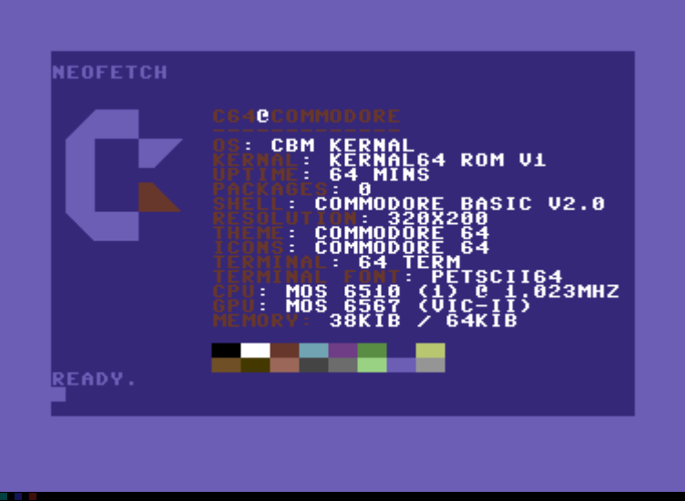

# neofetch.d64
Just a fun little program I wrote. It doesn't run anything it just loads the graphics into video memory. 

If someone runs this on original hardware. Send me a pic. 

# Gallery 
Here are all (1) of the pictures I recieved of it running on original hardware. 

### Breadbox

Credit: u/UKZzHELLRAISER on Reddit